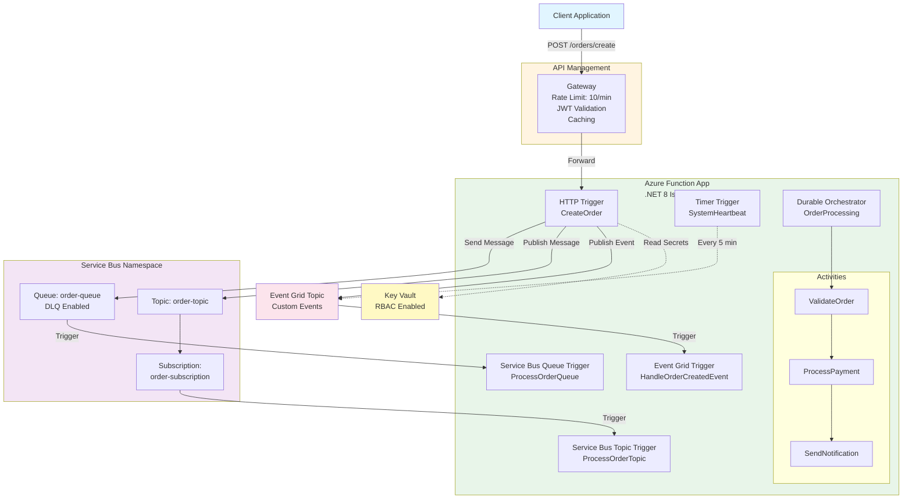
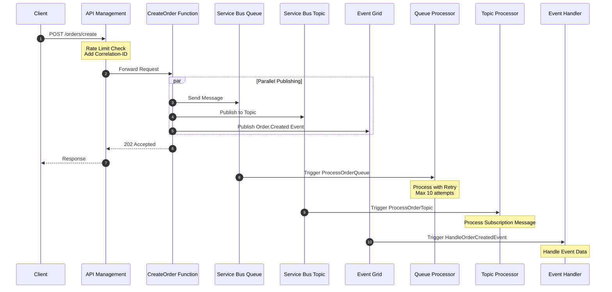
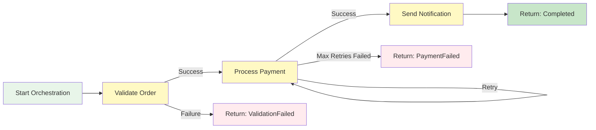
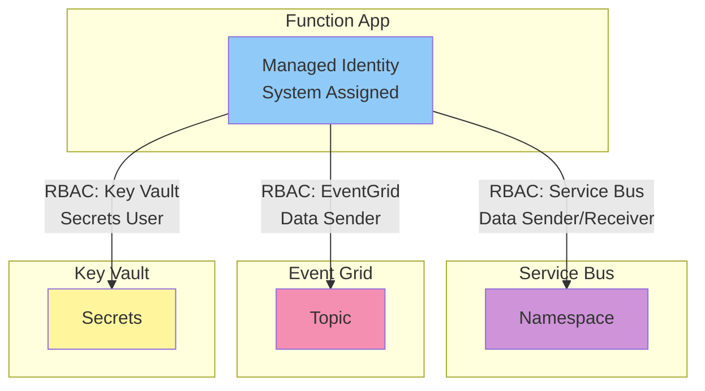
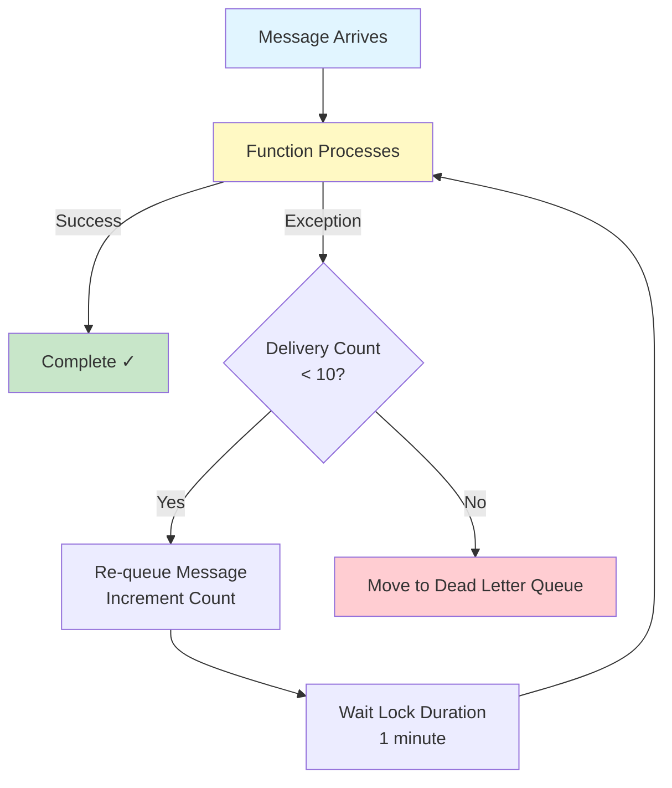
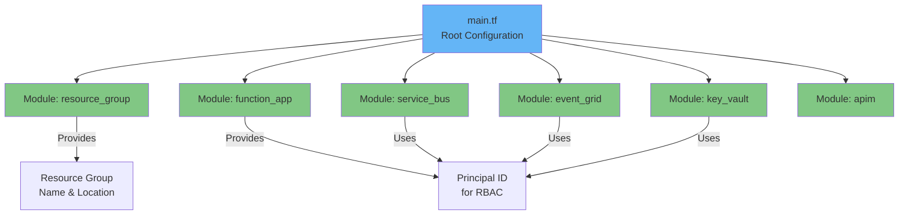

# Architecture Diagrams

## System Architecture (Mermaid)



## Event Flow Diagram



## Durable Orchestration Flow



## Security & Access Flow



## Retry & DLQ Flow



## Terraform Module Structure



## Component Interaction Matrix

| Component | Service Bus | Event Grid | Key Vault | APIM |
|-----------|-------------|------------|-----------|------|
| **HTTP Trigger** | ✓ Send | ✓ Publish | ✓ Read | Exposed via |
| **Queue Trigger** | ✓ Receive | - | - | - |
| **Topic Trigger** | ✓ Receive | - | - | - |
| **Event Grid Trigger** | - | ✓ Subscribe | - | - |
| **Timer Trigger** | - | ✓ Publish | - | - |
| **Durable Orchestrator** | - | - | - | - |

## Technology Stack

```
┌─────────────────────────────────────────┐
│         Application Layer               │
├─────────────────────────────────────────┤
│  .NET 8 (Isolated Worker)               │
│  Azure Functions v4                     │
│  Durable Functions                      │
└─────────────────────────────────────────┘

┌─────────────────────────────────────────┐
│         Messaging Layer                 │
├─────────────────────────────────────────┤
│  Azure Service Bus (Standard)           │
│  Azure Event Grid (Custom Topics)       │
└─────────────────────────────────────────┘

┌─────────────────────────────────────────┐
│         Security Layer                  │
├─────────────────────────────────────────┤
│  Managed Identity (System Assigned)     │
│  Azure Key Vault (RBAC)                 │
│  RBAC Role Assignments                  │
└─────────────────────────────────────────┘

┌─────────────────────────────────────────┐
│         API Gateway Layer               │
├─────────────────────────────────────────┤
│  Azure API Management (Developer)       │
│  - Rate Limiting                        │
│  - Caching                              │
│  - Security Policies                    │
└─────────────────────────────────────────┘

┌─────────────────────────────────────────┐
│         Infrastructure Layer            │
├─────────────────────────────────────────┤
│  Terraform v1.0+ (Module-based)         │
│  Azure Resource Manager                 │
└─────────────────────────────────────────┘
```

## Data Flow: Order Creation

```
1. Client Request
   └─> APIM Gateway
       ├─> Rate Limit Check (10/min)
       ├─> Add X-Correlation-Id
       └─> Cache Lookup

2. Function: CreateOrder
   └─> Parse Order JSON
       ├─> Validate Input
       └─> Generate Correlation ID

3. Parallel Message Publishing
   ├─> Service Bus Queue
   │   └─> order-queue
   │       └─> Queue Trigger (ProcessOrderQueue)
   │           ├─> Process Order
   │           ├─> Retry on Failure (max 10)
   │           └─> DLQ if max retries exceeded
   │
   ├─> Service Bus Topic
   │   └─> order-topic
   │       └─> Subscription (order-subscription)
   │           └─> Topic Trigger (ProcessOrderTopic)
   │
   └─> Event Grid
       └─> Custom Topic
           └─> Event (Order.Created)
               └─> Event Grid Trigger

4. Response
   └─> 202 Accepted
       └─> { orderId, correlationId }
```
