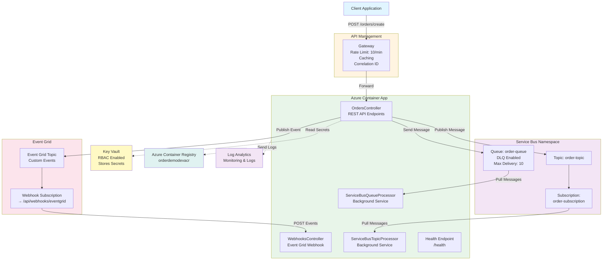
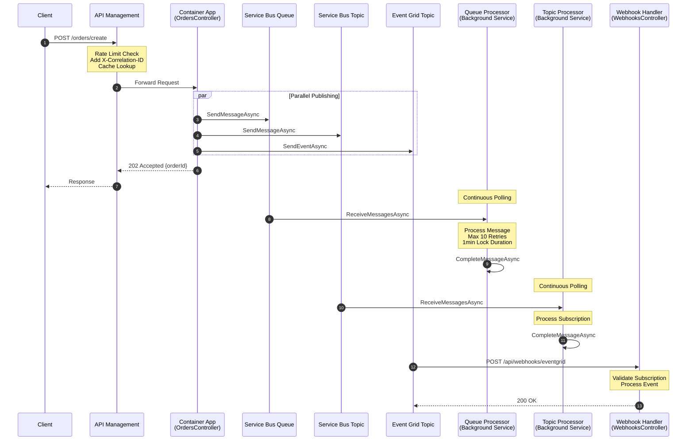
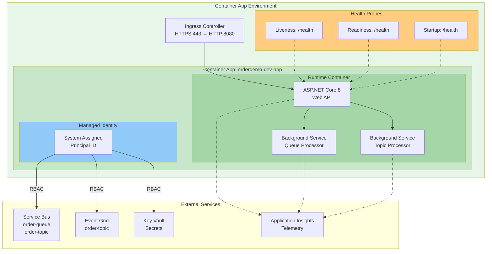
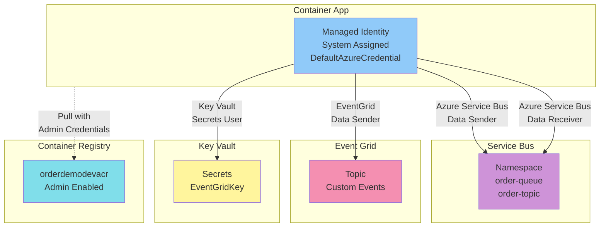
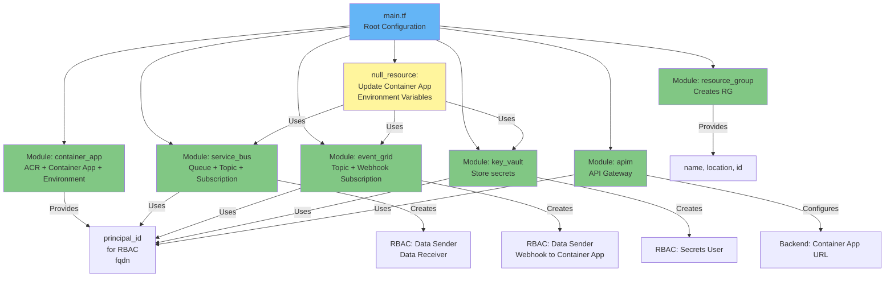

# Architecture Diagrams

## System Architecture (Mermaid)



## Event Flow Diagram



## Container App Architecture



## Security & Access Flow



## Retry & Dead Letter Queue Flow

```mermaid
graph TD
    Msg[Message Arrives<br/>in Queue/Topic] --> Receive[Processor Receives<br/>via ReceiveMessagesAsync]
    Receive --> Process[Process Message<br/>in Background Service]
    Process -->|Success| Complete[CompleteMessageAsync<br/>Remove from Queue ✓]
    Process -->|Exception| Abandon[AbandonMessageAsync<br/>Increment DeliveryCount]
    
    Abandon --> Count{DeliveryCount<br/>< MaxDeliveryCount<br/>&#40;10&#41;?}
    
    Count -->|Yes| Wait[Message Reappears<br/>After Lock Duration<br/>&#40;1 minute&#41;]
    Wait --> Receive
    
    Count -->|No| DLQ[Automatic Move to<br/>Dead Letter Queue<br/>&#40;DLQ&#41;]
    
    DLQ --> Manual[Manual Processing<br/>or Investigation Required]
    
    style Complete fill:#c8e6c9
    style DLQ fill:#ffcdd2
    style Msg fill:#e1f5ff
    style Process fill:#fff9c4
    style Manual fill:#fff9c4
```



## Terraform Module Structure



## Component Interaction Matrix

| Component | Service Bus | Event Grid | Key Vault | APIM | ACR |
|-----------|-------------|------------|-----------|------|-----|
| **OrdersController** | ✓ Send | ✓ Publish | ✓ Read | Exposed via | - |
| **Queue Processor** | ✓ Receive | - | - | - | - |
| **Topic Processor** | ✓ Receive | - | - | - | - |
| **Webhooks Controller** | - | ✓ Subscribe | - | - | - |
| **Container App** | - | - | - | - | ✓ Pull Image |
| **Health Endpoint** | - | - | - | ✓ Health Probe | - |

## Technology Stack

```
┌─────────────────────────────────────────┐
│         Application Layer               │
├─────────────────────────────────────────┤
│  .NET 8 ASP.NET Core Web API            │
│  RESTful Controllers                    │
│  Background Services (IHostedService)   │
│  Swagger/OpenAPI Documentation          │
└─────────────────────────────────────────┘

┌─────────────────────────────────────────┐
│         Container Platform              │
├─────────────────────────────────────────┤
│  Azure Container Apps (v1)              │
│  Azure Container Registry (Basic)       │
│  Container App Environment              │
│  Managed Identity Integration           │
└─────────────────────────────────────────┘

┌─────────────────────────────────────────┐
│         Messaging Layer                 │
├─────────────────────────────────────────┤
│  Azure Service Bus (Standard)           │
│  - Queues with DLQ                      │
│  - Topics & Subscriptions               │
│  Azure Event Grid (Custom Topics)       │
│  - Webhook Event Delivery               │
└─────────────────────────────────────────┘

┌─────────────────────────────────────────┐
│         Security Layer                  │
├─────────────────────────────────────────┤
│  Managed Identity (System Assigned)     │
│  DefaultAzureCredential                 │
│  Azure Key Vault (RBAC)                 │
│  RBAC Role Assignments                  │
└─────────────────────────────────────────┘

┌─────────────────────────────────────────┐
│         API Gateway Layer               │
├─────────────────────────────────────────┤
│  Azure API Management (Developer)       │
│  - Rate Limiting (10 calls/min)         │
│  - Response Caching (60s)               │
│  - Correlation ID Injection             │
│  - Backend: Container App               │
└─────────────────────────────────────────┘

┌─────────────────────────────────────────┐
│         Observability Layer             │
├─────────────────────────────────────────┤
│  Application Insights                   │
│  Log Analytics Workspace                │
│  Container App Logs                     │
│  Health Probes (Liveness/Readiness)     │
└─────────────────────────────────────────┘

┌─────────────────────────────────────────┐
│         Infrastructure Layer            │
├─────────────────────────────────────────┤
│  Terraform v1.0+ (Module-based)         │
│  Azure Resource Manager                 │
│  PowerShell Deployment Scripts          │
└─────────────────────────────────────────┘
```

## Data Flow: Order Creation

```
1. Client Request
   └─> APIM Gateway (orderdemo-dev-apim.azure-api.net)
       ├─> Rate Limit Check (10 calls/min)
       ├─> Add X-Correlation-Id Header
       └─> Cache Lookup (60s)

2. Container App: OrdersController.CreateOrder
   └─> Parse Order JSON
       ├─> Validate OrderRequest
       │   ├─> customerName (required)
       │   ├─> totalAmount > 0
       │   └─> items array (not empty)
       └─> Generate Order
           ├─> orderId = Guid.NewGuid()
           ├─> status = "Created"
           └─> createdAt = UTC Now

3. Parallel Message Publishing
   ├─> Service Bus Queue (order-queue)
   │   └─> ServiceBusClient.SendMessageAsync
   │       ├─> Body: Order JSON
   │       ├─> MessageId: orderId
   │       └─> CorrelationId: X-Correlation-Id
   │       
   │   Background Processing:
   │   └─> ServiceBusQueueProcessor (IHostedService)
   │       └─> Continuous Polling
   │           ├─> ReceiveMessagesAsync (MaxMessages: 10)
   │           ├─> Process Message
   │           │   ├─> Success → CompleteMessageAsync
   │           │   └─> Error → AbandonMessageAsync
   │           └─> MaxDeliveryCount: 10 → Move to DLQ
   │
   ├─> Service Bus Topic (order-topic)
   │   └─> ServiceBusClient.SendMessageAsync
   │       └─> Subscription: order-subscription
   │       
   │   Background Processing:
   │   └─> ServiceBusTopicProcessor (IHostedService)
   │       └─> Continuous Polling
   │           ├─> ReceiveMessagesAsync
   │           ├─> Process Subscription Message
   │           └─> CompleteMessageAsync
   │
   └─> Event Grid (orderdemo-dev-eg-topic)
       └─> EventGridPublisherClient.SendEventAsync
           ├─> EventType: "OrderCreated"
           ├─> Subject: "orders/{orderId}"
           ├─> DataVersion: "1.0"
           └─> Data: Order Object
           
       Event Delivery:
       └─> Webhook Subscription
           └─> POST https://{container-app-fqdn}/api/webhooks/eventgrid
               ├─> WebhooksController.HandleEventGridEvent
               ├─> Validation: Handle SubscriptionValidation
               ├─> Process: Handle OrderCreated Event
               └─> Return: 200 OK

4. Response
   └─> 202 Accepted
       └─> {
             "orderId": "...",
             "customerName": "...",
             "totalAmount": 149.99,
             "status": "Created",
             "createdAt": "2024-..."
           }
```
